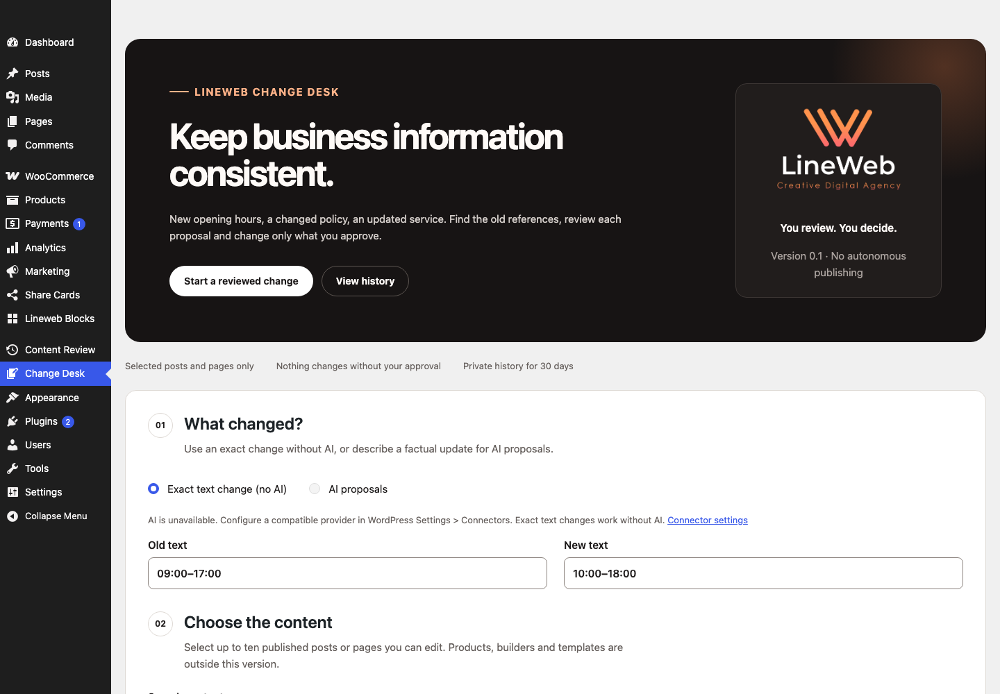
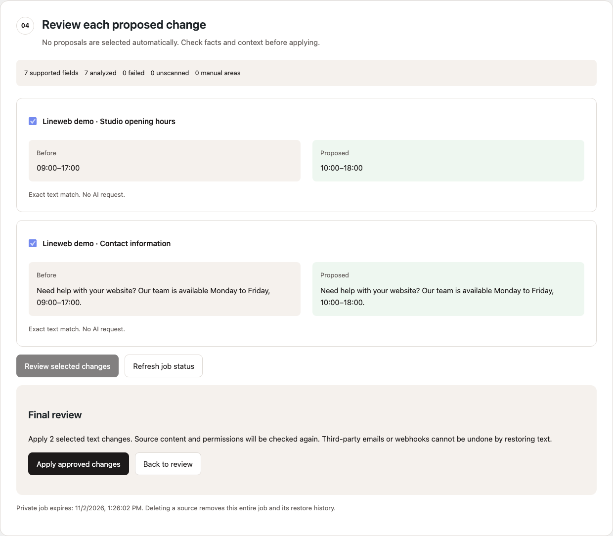
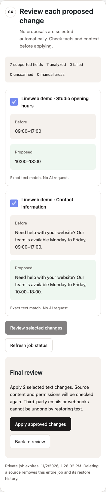

# Lineweb Change Desk: reviewed content changes for WordPress Gutenberg

Update opening hours, service details or policy wording across selected posts and pages. See each before/after proposal, approve only the changes you want, and restore the previous content when it is still safe to do so.

Free GPL software. Independent plugin. No Lineweb account, telemetry, autonomous publishing or WooCommerce dependency. Version 0.1 is a release candidate, not a production-certified AI agent.



## Two ways to work

- Exact text change: find a case-sensitive phrase inside supported text fields. This mode makes no AI request and works without a provider.
- AI proposals: describe a factual update using your site's compatible WordPress AI Client provider. The named provider is shown before transfer confirmation. Generated text is never applied automatically. AI may make mistakes: verify every fact and proposal.

## Your first change

1. Open **Change Desk** in WordPress administration.
2. Enter the old/new text, or choose AI and describe the factual update.
3. Select one to ten editable, published posts or pages and preview the extracted text.
4. For AI, confirm sending only those excerpts and your instruction to the displayed provider, then start analysis.
5. Review before/after cards. Nothing is preselected. Select proposals and review the final summary before applying.
6. Check the per-source result. Restore is offered only while the saved after-version remains current.



## Supported content and honest limits

Paragraph, heading, list-item and button text in ordinary Gutenberg blocks; nested groups, columns, lists and buttons are traversed. Inline emphasis and link destinations are preserved. Link targets, attributes, titles, metadata, prices, orders, templates and products are not rewritten.

Custom HTML, custom blocks, synced patterns, page builders and malformed markup need manual review. Phrases split across separate inline text nodes are not joined for matching. This is **not a complete-site scan**, search index or translation tool.

One preview is limited to ten posts/pages, 60,000 supported characters, 1,000 text fields and 1 MB raw content per source. AI uses at most five sequential chunks, each at most eight fields and 12,000 source characters. Oversized or remaining fields are explicitly unscanned. Truncated, invalid or mismatched model output fails the chunk rather than becoming an applicable proposal.

Each source is applied once per job. Approve all desired changes for that source before applying; start a new preview for subsequent changes. A batch can have partial successes: inspect every source outcome.

## Conflicts and restore

Content hashes, current permissions, published/unprotected status and another user's active editing lock are checked again under database guards. Newer content is not force-overwritten. Restore uses a private saved snapshot, not an assumption that WordPress revisions are enabled.

If a write or provider request cannot be verified, refresh the job and inspect the source. No uncertain request is automatically repeated. After ten minutes, an interrupted AI claim is marked as needing verification. Previously validated proposals remain reviewable after cancellation or interrupted analysis once no call is outstanding.

Transactions require InnoDB for WordPress posts, postmeta and options. Plugins that mutate the same database transaction can interfere; the tool detects tested guard violations but cannot guarantee atomicity against arbitrary foreign SQL. Restoring content cannot undo third-party email, webhooks or other external effects triggered by WordPress update hooks.

## AI, privacy and costs

The optional AI mode uses WordPress 7.0's native AI Client, with no bundled provider SDK, hardcoded API key or undeclared fallback. Configure a structured-text provider in **Settings > Connectors**. Provider credentials remain managed by WordPress/the provider plugin.

Only the confirmed extracted text, opaque field IDs and your instruction are sent. Text may contain personal information: review the preview and your legal basis before transfer. Your chosen provider's privacy, retention and pricing terms apply. No AI data is sent to Lineweb. Exact mode sends nothing externally.

Daily UTC quotas are 20 reserved calls per user and 50 per site. Reservations are recorded before dispatch; failed/interrupted attempts can consume quota even when the provider did not bill. Provider charges are not estimated or refunded by this plugin. Cancel stops future chunks; it cannot revoke a request already sent.

Jobs, excerpts and restore snapshots are private and expire after 30 days. Expired jobs cannot be used and are deleted in bounded hourly batches when WP-Cron runs. Deleting a selected source removes its **entire associated job**, including the other sources' restore history. Delete private history manually if you need earlier removal. Deactivation stops cleanup but keeps content and jobs; uninstall removes only the plugin's jobs, counters and scheduled event, leaving source posts and revisions unchanged.



## Requirements and installation

WordPress 7.0+, PHP 8.3+, Gutenberg-authored published posts/pages, InnoDB storage and an administrator/editor who can edit others' posts and each chosen source. Only a job's owner can analyze/apply/restore it. Administrators can inspect or delete jobs they have source access to.

Build an installable ZIP from this repository, then upload it through Plugins > Add New > Upload Plugin. A compatible provider is optional; exact mode is usable immediately. Public tagged releases and WordPress.org availability are separate from this candidate source.

```sh
npm install --legacy-peer-deps
npm run test:unit
npm run lint:js
npm run lint:css
npm run lint:php
npm run build
npm run plugin-zip
```

JavaScript uses WordPress-provided React and API libraries on this admin screen only. There are no storefront assets or frontend React runtime. Readable source is in `src/admin/`; compiled assets are in `build/admin/`. Tests use synthetic content and an in-memory native SDK fixture, not a live model demonstration. A real configured-provider evaluation and two approved staging installations remain required before a public production release.

English and native Greek (`el`, with `el_GR` compatibility) are included for direct installation. WordPress.org language packs have not been approved; a directory submission will use its language-pack policy.

All screenshots use synthetic demonstration content. [Support](SUPPORT.md) · [Security policy](SECURITY.md) · [Lineweb](https://lineweb.gr/)
